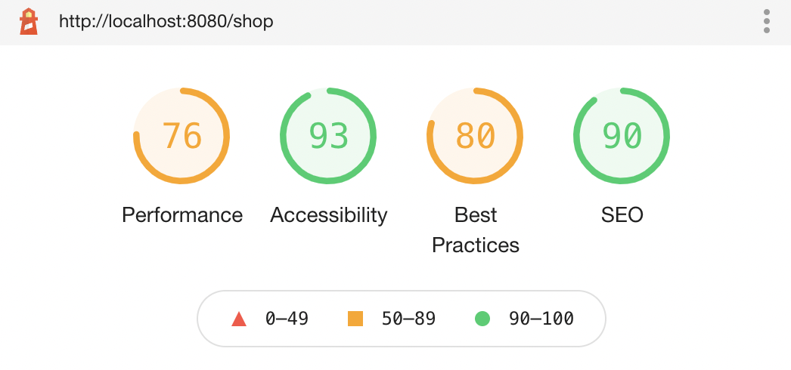

# Web Store 

A web store application built using React JS.

## Status

### Deployment

[](https://app.netlify.com/sites/ecomm-project/deploys)

### Lighthouse




## Testing

    Install the project dependencies
    ```shell
    npm install
    ```

    Run the application
    ```shell
    npm run start
    ```

